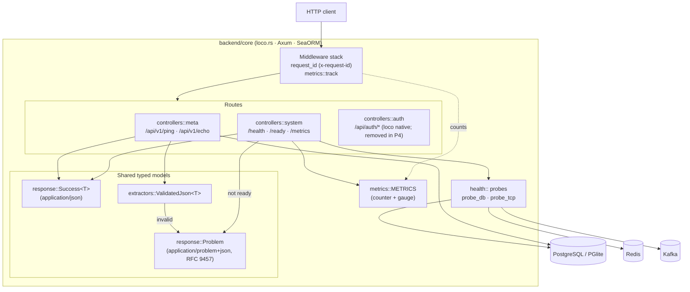
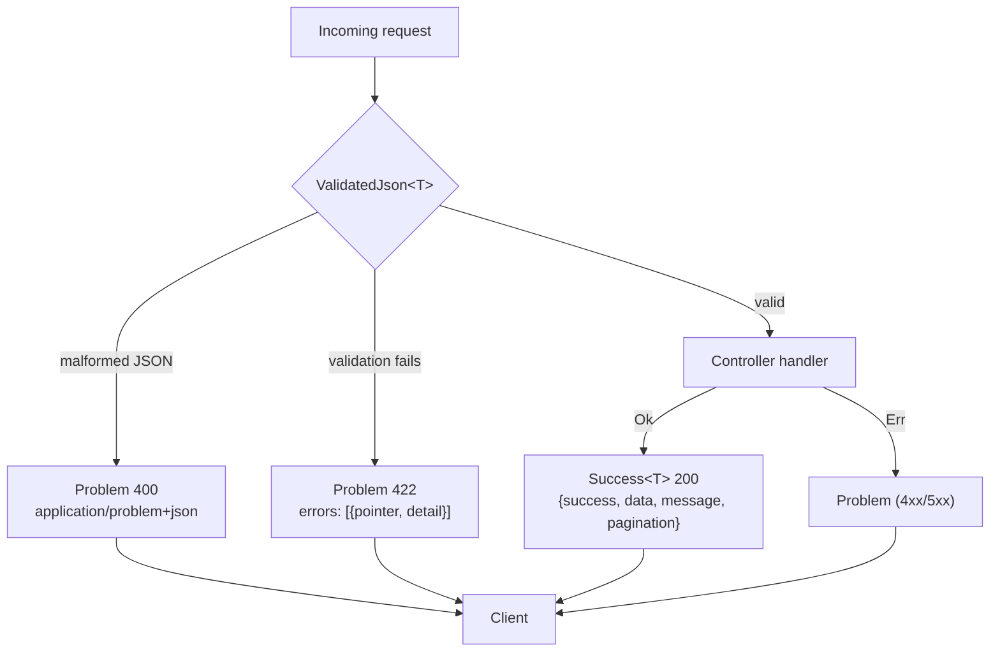
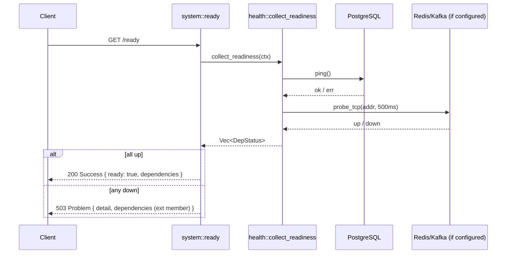

# P3 — Backend Core Bootstrap

Phase-implementation document for **P3** of the SuperApp roadmap
(`PHASES.md`). Covers the loco.rs scaffold, config, SeaORM/DB, structured
logging, the shared response contract, request validation, health/readiness,
and Prometheus metrics.

All work is test-driven (TR-00-001): each requirement's **Accept** criteria are
encoded as automated tests. Backend tests run against an in-memory PGlite
Postgres, **serially** (`cargo test --test mod -- --test-threads=1`).

## Requirement coverage

| Requirement | Summary | Design / where | Proving tests |
|---|---|---|---|
| **TR-03-001** | Versioned `/api/v1` base + baseline route (200) | `controllers/meta.rs` (`/api/v1/ping`); registered in `app.rs`; visible in `cargo loco routes` | `tests/requests/meta.rs::ping_returns_200_success_envelope_with_request_id_header` |
| **TR-03-002** | SeaORM pooled connection + baseline migration + round-trip | P2 config → `config/*.yaml`; migration `migration/src/m20220101_000001_users.rs` | `tests/models/db.rs::seaorm_insert_is_read_back` |
| **TR-03-003** | House success envelope + RFC 9457 problem, shared typed models | `src/response.rs` (`Success<T>`, `Problem`, `FieldError`, `Pagination`) | `src/response.rs` unit tests (6) |
| **TR-03-004** | Request validation → `422` problem with `errors` extension | `src/extractors.rs` (`ValidatedJson`); `controllers/meta.rs` (`/api/v1/echo`) | `extractors.rs` unit tests; `tests/requests/meta.rs::echo_*` |
| **TR-03-005** | Structured logging + per-request id in response header | loco `request_id` middleware (default on); `config/production.yaml` `logger.format: json` | `tests/requests/meta.rs` (asserts `x-request-id` header) |
| **TR-03-006** | `/health` liveness + `/ready` readiness (PG/Redis/Kafka) | `src/health.rs` (probes + aggregation); `controllers/system.rs` | `health.rs` unit tests (probe up/down, aggregate); `tests/requests/system.rs::health_*`, `ready_*` |
| **TR-03-007** | Prometheus `/metrics` endpoint | `src/metrics.rs` (registry + `track` middleware); `initializers/metrics.rs`; `controllers/system.rs` | `metrics.rs` unit test; `tests/requests/system.rs::metrics_*` |
| **TR-00-001** | Test-driven development | every requirement above ships with tests | full suite: 12 lib + 30 integration, all green |

## Component architecture

## Response contract (TR-03-003 / TR-03-004)

Every 2xx uses the house envelope; every non-2xx is an RFC 9457 problem. Both
are shared Rust types implementing `IntoResponse` — controllers never emit
ad-hoc error JSON.

## Readiness flow (TR-03-006)

`/health` is pure liveness (always 200 while the process runs). `/ready`
aggregates dependency probes: PostgreSQL always, plus Redis/Kafka when their
`host:port` is configured under `settings.readiness`. Any probe down ⇒ `503`
as a problem document whose `dependencies` extension member lists each status.

> The test profile (`config/test.yaml`) omits `settings.readiness`, so `/ready`
> probes only the (reachable) database and is deterministically `200`. The
> Redis/Kafka probe logic and the down → `503` aggregation are covered by
> `health.rs` unit tests against real reachable/closed TCP ports.

## Notes & carry-forward

- **loco native auth** (`/api/auth/*`) remains from the scaffold and is
  **out of P3 scope**; TR-04-002 removes it in P4 in favour of Rauthy OIDC.
- **Metrics** are hand-rolled (no `metrics-exporter-prometheus`) to respect the
  repo's rustc 1.85 MSRV pins.
- **Test DB**: PGlite over the PG wire protocol; must be launched as a
  harness-managed background process (`testdb/server.mjs`) and tests run with
  `--test-threads=1`.
- `config/production.yaml` was created this phase (was empty) with JSON logging
  and env-driven secrets.
