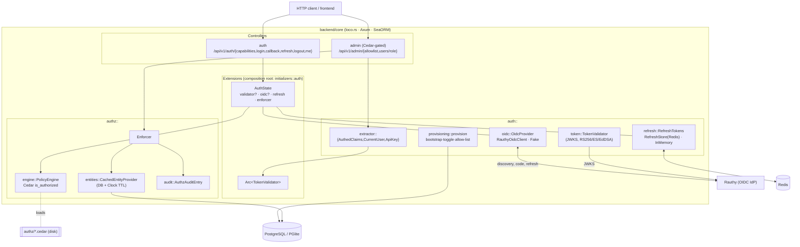
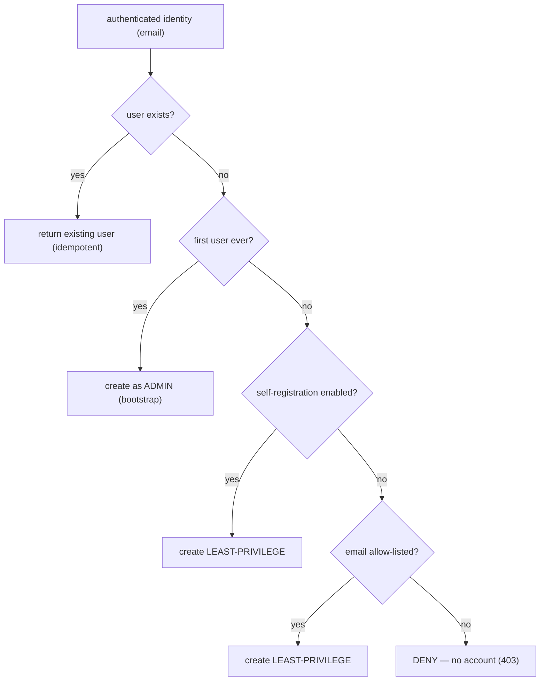
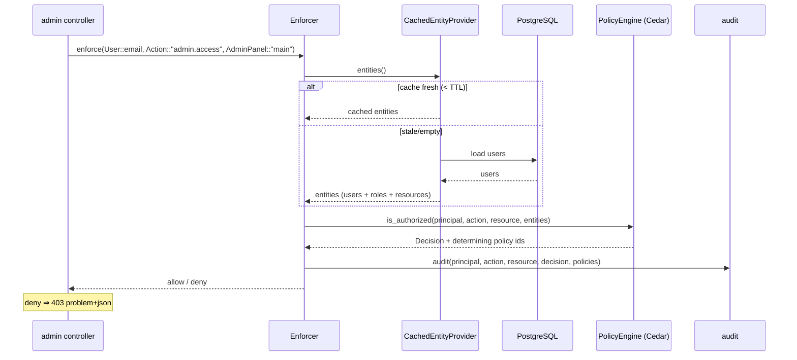

# P4 — Authentication, SSO & Policy-based AuthZ

Phase-implementation document for **P4** of the SuperApp roadmap
(`PHASES.md`). Covers Rauthy OIDC authentication (relying party), JWKS
access-token validation, Redis-backed refresh rotation, email-keyed user
provisioning with admin bootstrap / self-registration toggle / allow-list, and
**Cedar** policy-based authorization (enforcement point, schema + policy set,
DB entity provider with caching, and audit).

All work is test-driven (TR-00-001): each requirement's **Accept** criteria are
encoded as automated tests. Backend tests run against an in-memory PGlite
Postgres and the live Redis, **serially**
(`cargo test -- --test-threads=1`).

## Locked decisions honoured

- **Rauthy is the sole authentication authority** — both SSO/federation and
  username/password are Rauthy methods; the backend never authenticates
  passwords locally and validates all Rauthy-issued tokens uniformly.
- **Backend is a confidential OIDC client / token broker**: it runs the
  authorization-code flow, stores the Rauthy **refresh token** in Redis behind
  an opaque handle, and hands clients a short-lived access token + that handle
  (so refresh rotation and reuse-detection live server-side — TR-04-003).
- **Identity key = email** (OIDC `email` claim); provisioning is idempotent by
  email.
- **Cedar** (`cedar-policy` 4.0.1) is the authorization engine.
- **Dependency injection**: every side-effecting collaborator (OIDC network,
  Redis, DB, clock) sits behind a trait and is injected at the composition root
  (`AuthState` / `initializers::auth`), so tests substitute in-memory fakes.
- loco's native `/api/auth/*` auth is **not wired** (TR-04-002).

## Requirement coverage

| Requirement | Summary | Design / where | Proving tests |
|---|---|---|---|
| **TR-04-001** | OIDC discovery + auth-code flow + JWKS validation via Rauthy | `auth::token::TokenValidator` (JWKS), `auth::oidc` (`OidcProvider` trait + `RauthyOidcClient` + `discover_jwks`), `auth::service::complete_login` | `auth::token::tests::*` (7), `auth::oidc::tests::fake_provider_exchanges_code_and_refresh`, `tests/auth/flow.rs::login_then_refresh_rotates_and_invalidates_old_handle` |
| **TR-04-002** | Auth extractor + protected route 401/2xx; native auth disabled | `auth::extractor` (`AuthedClaims`, `CurrentUser`); `app.rs` omits loco native routes; validator injected via `Extension` | `tests/requests/auth.rs::{me_returns_401_without_token, me_returns_401_with_garbage_token, me_returns_200_with_valid_token, native_loco_auth_endpoints_are_not_exposed}`, `auth::extractor::tests::*` |
| **TR-04-003** | Short access + long refresh with rotation; refresh in Redis | `auth::refresh` (`RefreshTokens` trait, `RefreshStore` (Redis), `InMemoryRefreshStore`); `auth::service::refresh_session` | `auth::refresh::tests::*` (4, live Redis), `tests/auth/flow.rs::login_then_refresh_rotates_and_invalidates_old_handle` |
| **TR-04-004** | First user → admin (bootstrap); idempotent email provisioning | `auth::provisioning` (`decide`, `provision`) | `auth::provisioning::tests::*`, `tests/auth/provisioning.rs::first_user_is_admin_and_provisioning_is_idempotent` |
| **TR-04-005** | Cedar enforcement point → 403 on deny | `authz::engine::PolicyEngine::is_authorized`, `authz::Enforcer::enforce`; gate in `controllers::admin` | `authz::engine::tests::{admin_is_allowed_admin_panel_access, regular_user_is_denied_admin_panel_access, user_may_read_own_profile_but_not_another}`, `tests/requests/auth.rs::admin_route_denies_regular_user_but_allows_admin` |
| **TR-04-006** | Cedar schema + policy set, reloadable from disk, validated | `authz/schema.cedarschema`, `authz/policies/*.cedar`, `PolicyEngine::load_from_dir`, `validate_policies` | `authz::engine::tests::policies_validate_against_schema` (+ `load_from_dir` used by all engine tests) |
| **TR-04-007** | Cedar entities materialised from DB with cache | `authz::entities` (`EntityProvider`, `DbEntityProvider`, `CachedEntityProvider` + injected `Clock`) | `authz::entities::tests::{user_entity_json_carries_role_and_group_membership, cache_serves_stale_within_ttl_then_refreshes}` |
| **TR-04-008** | Audit log of principal/action/resource/decision/policy-ids | `authz::audit::AuthzAuditEntry`; emitted by `Enforcer::enforce` | `authz::audit::tests::entry_captures_decision_and_policies` |
| **TR-04-009** | Service-to-service `X-API-Key` auth; revocable | `models::api_keys` (hash/verify/revoke), `auth::extractor::ApiKey` | `models::api_keys::tests::*`, `tests/auth/api_keys.rs::mint_authenticate_then_revoke` |
| **TR-04-010** | Username/password via Rauthy validated identically to SSO | Uniform JWKS validation in `auth::token` (login method is opaque to the backend) | `auth::token::tests::accepts_a_valid_token_and_extracts_email` (+ flow test) |
| **TR-04-011** | Startup self-registration toggle (default off) | `auth::config::{self_registration_enabled, parse_self_registration}`; threaded into `provision` | `auth::config::tests::{self_registration_defaults_to_false, self_registration_truthy_values}`, `tests/auth/provisioning.rs::self_registration_enabled_creates_least_privilege` |
| **TR-04-012** | Least-privilege role for self-onboarded users | `auth::provisioning::Decision::role`, `models::role::Role::LEAST_PRIVILEGE` | `auth::provisioning::tests::self_registration_enabled_creates_least_privilege`, `models::role::tests::*` |
| **TR-04-013** | Admin email allow-list when self-registration off | `models::allowlisted_emails`; gate in `provision` | `tests/auth/provisioning.rs::toggle_off_denies_then_allowlist_permits_least_privilege`, `tests/auth/flow.rs::login_denied_for_unknown_identity_when_toggle_off` |
| **TR-00-001** | Test-driven development | every requirement above ships with tests | full suite green (lib unit + integration) |

## Component architecture



## Login & refresh (token broker) flow (TR-04-001 / 003 / 004)

```mermaid
sequenceDiagram
    participant C as Client
    participant A as auth controller
    participant O as OidcProvider (Rauthy)
    participant V as TokenValidator (JWKS)
    participant P as provisioning (DB)
    participant R as RefreshTokens (Redis)

    C->>A: GET /auth/login
    A->>O: authorize_url() (PKCE+CSRF+nonce)
    A-->>C: { authorize_url, state, ... }
    C->>O: (browser) authenticate @ Rauthy
    C->>A: POST /auth/callback { code, pkce_verifier }
    A->>O: exchange_code(code, verifier)
    O-->>A: { access_token, refresh_token }
    A->>V: validate(access_token)  (iss/aud/exp/sig)
    V-->>A: claims (email)
    A->>P: provision(email, toggle)  (bootstrap/allow-list)
    P-->>A: user (role)
    A->>R: issue({user, rauthy_refresh}) → handle
    A-->>C: { access_token, refresh_handle, role }

    Note over C,R: Refresh rotates the handle; the old one is consumed
    C->>A: POST /auth/refresh { refresh_handle }
    A->>R: get(handle) → rauthy_refresh
    A->>O: refresh(rauthy_refresh)
    O-->>A: { access_token, refresh_token' }
    A->>V: validate(access_token)
    A->>R: rotate(old_handle, refresh_token') → new_handle
    A-->>C: { access_token, refresh_handle=new }
```

## Provisioning decision (TR-04-004 / 011 / 012 / 013)



## Authorization (Cedar PEP) flow (TR-04-005 / 007 / 008)



## Schema, entities & config

- **Migrations** (`migration/src/`): `add_role_to_users` (role column, default
  `user`), `allowlisted_emails`, `api_keys`.
- **Roles**: `models::role::Role` (`admin` / least-privilege `user`); Cedar
  models roles as `Role` group membership on the `User` principal.
- **Config** (`settings.auth` + env): OIDC issuer/client/redirect, token TTLs,
  `redis_url`, and — for environments without live discovery — a static
  `jwks_json`/`issuer`/`audience`. The self-registration toggle is the startup
  env var `SUPERAPP_BACKEND_SELF_REGISTRATION_ENABLED` (default `false`).

## Notes & carry-forward

- **No live Rauthy in this environment**: the OIDC *network* client
  (`RauthyOidcClient`) is exercised only by compilation; the flow
  *orchestration* is proven against `FakeOidcProvider`, and JWKS validation is
  proven against a deterministic embedded test key (matching `config/test.yaml`
  and `tests/support`). Wiring against a real Rauthy is an integration concern
  for deployment (P10).
- **Login transient state** (`pkce_verifier`/`state`/`nonce`) is currently
  returned to the caller from `/auth/login`; a browser BFF should instead store
  these server-side (keyed by `state`) or in an HttpOnly cookie. Tracked as a
  hardening follow-up.
- **loco native auth model methods** (`create_with_password`, magic-link, …)
  remain on `users::Model` as vestigial scaffold but are no longer routed;
  removal is deferred to avoid churn to P3 model tests.
- **API-key routes**: the `X-API-Key` extractor and model are complete and
  tested; mounting module-facing routes that require it lands with the module
  runtime in P5.
```
