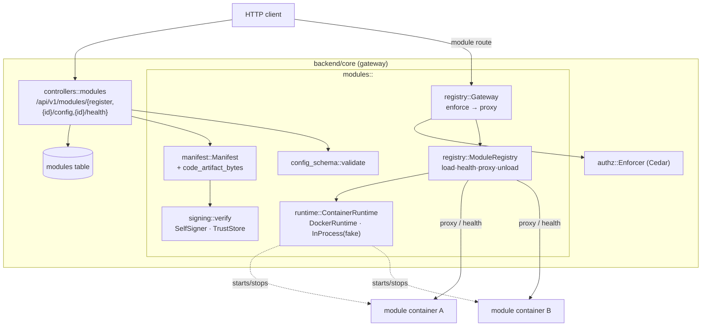
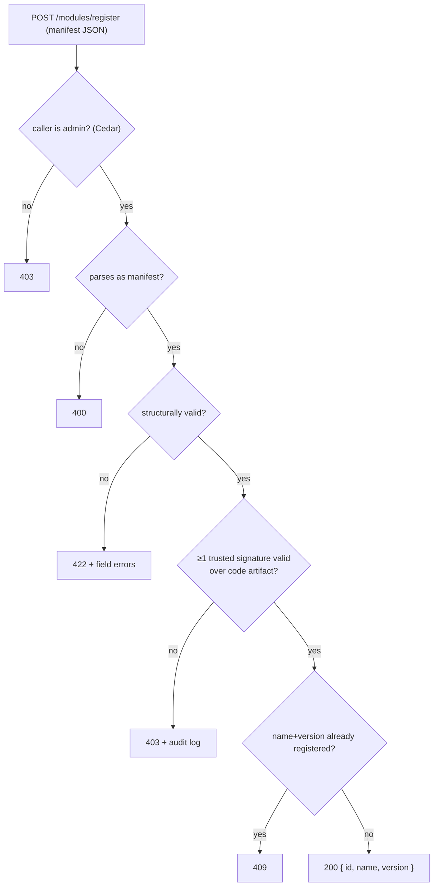
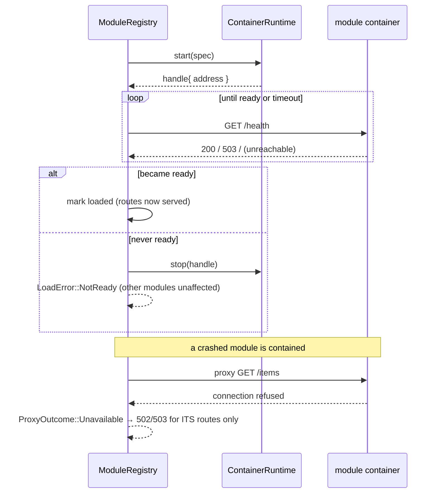
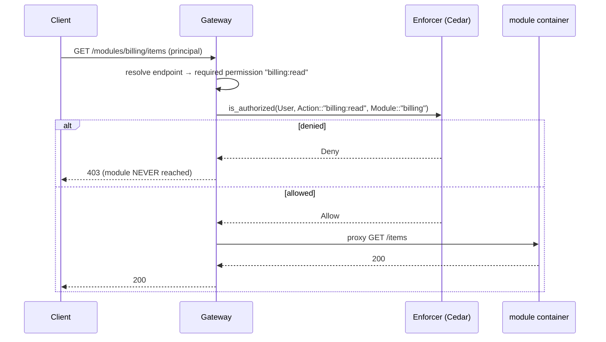

# P5 — Dynamic Module Loading

Phase-implementation document for **P5** of the SuperApp roadmap
(`PHASES.md`). Covers the out-of-process module runtime, the core **gateway**
(route proxying + Cedar enforcement), secure signature verification with a
self-signing key bootstrap, module registration, config-schema validation,
per-module health, lifecycle management, and fault isolation.

All work is test-driven (TR-00-001): each requirement's **Accept** criteria are
encoded as automated tests. Backend tests run against PGlite + live Redis,
**serially** (`cargo test -- --test-threads=1`).

## Locked decisions honoured

- **Out-of-process containers behind a core gateway** — modules are their own
  containers; the core starts/health-checks/proxies/stops them and enforces
  **Cedar** at the gateway edge.
- **Signed OCI distribution** — modules carry an **array** of ed25519
  signatures; the backend bootstraps a **self-signing keypair** and trusts it
  plus configured external signers; a module loads iff ≥1 trusted signature
  validates over the **immutable code artifact** (config/data excluded).
- **Dependency injection** — the container runtime sits behind the
  [`ContainerRuntime`](../../backend/core/src/modules/runtime.rs) trait
  (production `DockerRuntime`; tests use an in-process runtime that starts real
  local HTTP servers), so the gateway/lifecycle/fault-isolation logic is tested
  end-to-end without Docker.

## Requirement coverage

| Requirement | Summary | Design / where | Proving tests |
|---|---|---|---|
| **TR-05-001** | Runtime + gateway route proxying | `modules::runtime` (`ContainerRuntime`), `modules::registry` (`ModuleRegistry::proxy_get`, `Gateway`) | `modules::registry::tests::load_reaches_ready_and_proxies_then_unloads` |
| **TR-05-002** | Verify signature array; ≥1 trusted valid; code-covering | `modules::signing::verify`, `manifest::code_artifact_bytes` | `modules::signing::tests::*` (6), `requests::modules::register_rejects_untrusted_signature_with_403` |
| **TR-05-003** | `POST /modules/register` (id, dedupe, 422) | `controllers::modules::register`, `models::modules::Model::register`, `manifest::validation_errors` | `requests::modules::{register_signed_manifest_returns_id_and_rejects_duplicate, register_rejects_invalid_manifest_with_422}`, `manifest::tests` |
| **TR-05-004** | Lifecycle: start → readiness → stop; failed start rejected | `registry::{load, unload, await_ready}` | `registry::tests::{load_reaches_ready_and_proxies_then_unloads, unhealthy_module_fails_readiness}` |
| **TR-05-005** | Per-module health endpoint | `registry::health`, `controllers::modules::health` | `registry::tests::load_reaches_ready_and_proxies_then_unloads` (health probe) |
| **TR-05-006** | `PUT /modules/{id}/config` schema validation | `modules::config_schema::validate`, `controllers::modules::set_config` | `config_schema::tests::*` (5), `requests::modules::config_validated_against_schema` |
| **TR-05-007** | Permissions → Cedar; gateway enforces before proxy | `registry::Gateway::handle` (enforce → proxy) | `registry::tests::gateway_denies_unpermitted_request_before_proxying` |
| **TR-05-008** | Fault isolation of a failing module | `registry::proxy_get` (contains connection errors → Unavailable) | `registry::tests::crashed_module_is_fault_isolated_from_others` |
| **TR-05-009** | Self-signing key bootstrap + trust store | `signing::SelfSigner::load_or_generate`, `TrustStore`; wired in `AuthState::build` | `signing::tests::{load_or_generate_persists_and_reloads_same_key, accepts_module_with_one_trusted_signature}` |
| **TR-00-001** | TDD | every requirement above ships with tests | full suite green |

## Component architecture



## Registration & verification (TR-05-002 / 003)



## Lifecycle & fault isolation (TR-05-004 / 005 / 008)



## Gateway authorization (TR-05-007)



## Schema, config & wiring

- **Migration** `m20250711_000001_modules`: `modules` table (manifest/config as
  JSON text, `status`, `address`, unique `(name, version)`).
- **Config** (`settings.modules`): `signing_key_path` (self-key persistence)
  and `trusted_signers[]` (external ed25519 public keys). Module env uses the
  `SUPERAPP_MODULE_{NAME}_` prefix.
- **Composition root**: `AuthState::build` bootstraps the self-signing key,
  assembles the trust store, and wires the `ModuleRegistry` (Docker runtime) +
  Cedar-enforcing `Gateway`, layered into the router alongside the P4 auth
  state.

## Notes & carry-forward

- **No Docker in this environment**: `DockerRuntime` (shells out to the `docker`
  CLI) is compile-verified; all lifecycle/gateway/fault-isolation behaviour is
  proven against the in-process runtime (real local HTTP servers). Running real
  module containers is a deployment/P10 concern (compose orchestration,
  TR-10-005).
- **Transport**: the gateway proxies module **HTTP** routes, satisfying
  TR-05-001's Accept criteria and keeping the runtime seam testable. The
  architecture's target of **gRPC** core↔module comms + module micro-frontends
  is deferred to the module SDK (P9), where the transport behind
  `ContainerRuntime`/proxy is a localized swap.
- **Cedar module actions**: a module's declared permissions are enforced as
  Cedar `Action::"<perm>"` on `Module::"<name>"`. Absent a granting policy a
  non-admin is denied (fail-closed); admins pass via the existing
  `admin-full-access` policy. Per-module grant policies drop into the
  reloadable policy set (TR-04-006).
- **Live gateway proxy route** through the booted app (with a real running
  module) is not mounted in P5 core; the gateway logic is proven hermetically
  and the end-to-end wiring lands with the reference module in P9 (TR-09-007).
```
