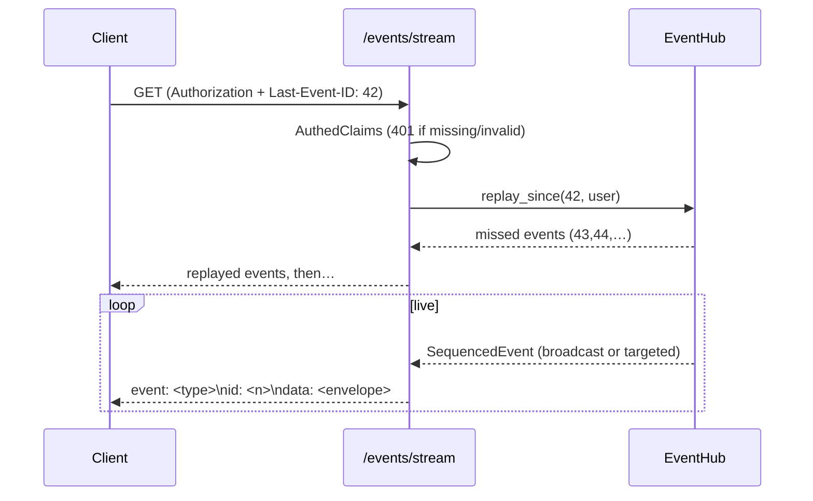
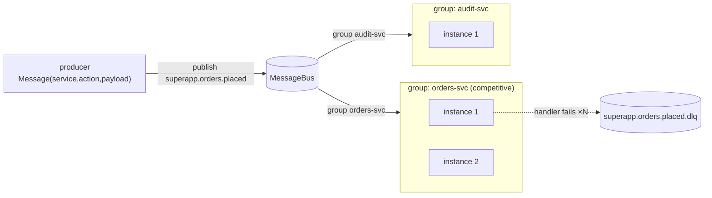

# P6 — Real-time & Messaging

Phase-implementation document for **P6** of the SuperApp roadmap
(`PHASES.md`). Covers the authenticated Server-Sent Events (SSE) stream with
targeted/broadcast delivery and reconnect-resume, and the asynchronous
messaging layer (Kafka topic conventions, consumer groups, and a dead-letter
queue) exposed to services and modules.

All work is test-driven (TR-00-001). Backend tests run against PGlite + live
Redis, **serially** (`cargo test -- --test-threads=1`).

## Locked decisions & constraints

- **Real-time = HTTP SSE** with an in-process fan-out hub; **async = Kafka**
  topic conventions.
- **No Kafka broker in this environment** (nothing on `:9092`), and `rdkafka`
  needs a native C library that jeopardises the rustc-1.85 build. So messaging
  sits behind the [`MessageBus`](../../backend/core/src/messaging/mod.rs) trait:
  an [`InMemoryBus`] faithfully models topic fan-out + consumer-group
  competitive delivery (MPMC channels) and backs all tests; a Kafka wire
  adapter is a drop-in for deployment (P10, TR-10-005).
- **Dependency injection** — producers/consumers and the event hub are injected
  (via `AuthState`), so delivery semantics are tested hermetically.

## Requirement coverage

| Requirement | Summary | Design / where | Proving tests |
|---|---|---|---|
| **TR-06-001** | Authenticated SSE stream; unauth → 401 | `controllers::events::stream` (SSE + `AuthedClaims`), `events::hub` | `requests::events::event_stream_requires_authentication`; delivery: `events::hub::tests::*` |
| **TR-06-002** | Envelope `{type,data,timestamp,user_id}`; targeted vs broadcast | `events::envelope::EventEnvelope` | `events::envelope::tests::*` (3), `events::hub::tests::{broadcast_reaches_all_subscribers, targeted_event_reaches_only_target}` |
| **TR-06-003** | Publish domain events routed to subscribers | `events::hub::EventHub::publish`, `envelope::types` | `events::hub::tests::{broadcast_reaches_all_subscribers, targeted_event_reaches_only_target}` |
| **TR-06-004** | Topics `superapp.{service}.{action}` + metadata envelope | `messaging::{topic_name, Message, Metadata}` | `messaging::tests::{topic_and_dlq_naming, message_envelope_has_required_schema}` |
| **TR-06-005** | Consumer groups (one per service; no double-processing) | `messaging::{MessageBus, InMemoryBus, Consumer}` | `messaging::tests::{single_consumer_receives_published_message, same_group_shares_without_double_processing, different_groups_each_receive_all}` |
| **TR-06-006** | Retry then dead-letter, preserving original + metadata | `messaging::dlq::{process_with_retries, route_to_dlq}` | `messaging::dlq::tests::{failing_message_is_retried_then_dead_lettered_preserving_original, message_succeeding_within_retries_is_not_dead_lettered}` |
| **TR-06-007** | Module access to messaging | `MessageBus` trait = the core-provided publish/consume API | `messaging::tests::{single_consumer_receives_published_message, different_groups_each_receive_all}` |
| **TR-06-008** | SSE reconnect/resume via `Last-Event-ID` | `hub::EventHub::replay_since` (bounded ring buffer), `controllers::events::stream` | `events::hub::tests::replay_since_returns_missed_events_for_resume` |
| **TR-00-001** | Test-driven development | every requirement above ships with tests | full suite green |

## SSE architecture (TR-06-001/002/003/008)

```mermaid
flowchart TB
    subgraph Core["backend/core"]
        Pub["publishers<br/>(services, controllers)"]
        Hub["events::EventHub<br/>seq id · broadcast · ring buffer"]
        EP["controllers::events<br/>GET /api/v1/events/stream (auth)"]
    end
    A["client A (alice)"]
    B["client B (bob)"]

    Pub -->|publish(EventEnvelope)| Hub
    A -->|SSE + Last-Event-ID| EP
    B -->|SSE| EP
    EP -->|subscribe(user)| Hub
    Hub -->|broadcast + targeted(alice)| A
    Hub -->|broadcast only| B
```



## Messaging architecture (TR-06-004/005/006/007)



- **Topics**: `superapp.{service}.{action}`; DLQ is `{topic}.dlq`.
- **Envelope**: `{ id, service, action, payload, metadata{ timestamp, attempt,
  headers } }`.
- **Consumer groups**: each group receives every message once; multiple
  instances in a group compete (MPMC), so partitions are shared with no
  double-processing.
- **DLQ**: `process_with_retries` attempts up to `max_attempts`; on exhaustion
  `route_to_dlq` publishes a dead-letter carrying the original message + the
  attempt count and last error.

## Wiring

- `AuthState` gains an `Arc<EventHub>` (real-time) shared across requests;
  services publish through it and the SSE controller subscribes to it.
- The `MessageBus` is the module-facing messaging API (TR-06-007); the
  in-memory implementation is the default, swapped for Kafka in deployment.

## Notes & carry-forward

- **Live SSE receipt** over the long-lived HTTP connection is not asserted
  through the request harness (a keep-alive stream never terminates, so
  `.await` would hang); delivery/targeting/resume are proven by the hub unit
  tests, and the endpoint's auth gate is proven at the request level.
- **HTTP/2**: SSE is protocol-version-agnostic; serving it over HTTP/2 is a
  server/deployment setting (TLS/h2), not an application change.
- **Kafka adapter**: implementing `MessageBus` over a real broker (and wiring
  the produced-topic health into `/ready`) lands with the compose/deploy work
  in P10; no `rdkafka` dependency is added on the rustc-1.85 toolchain.
```
