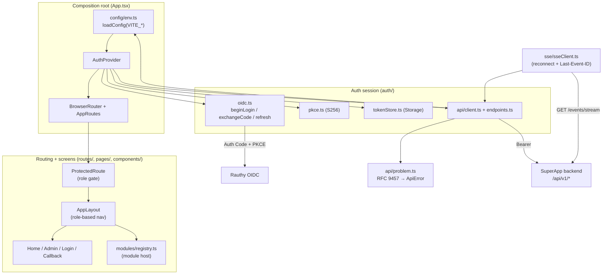
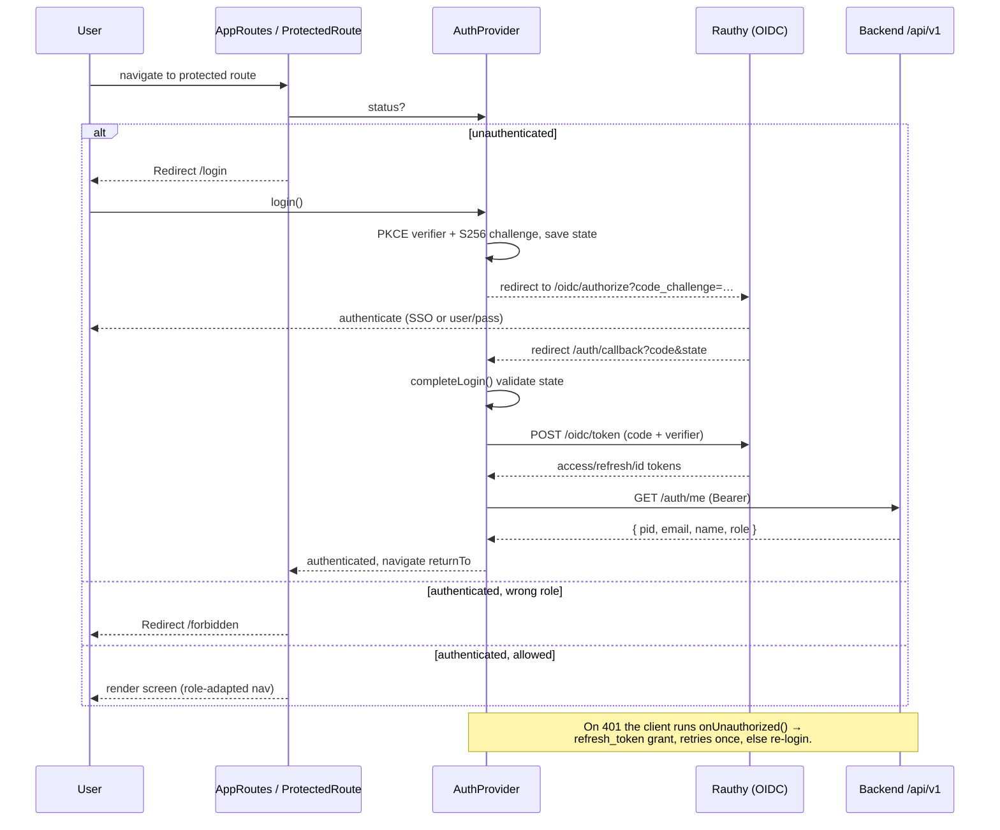
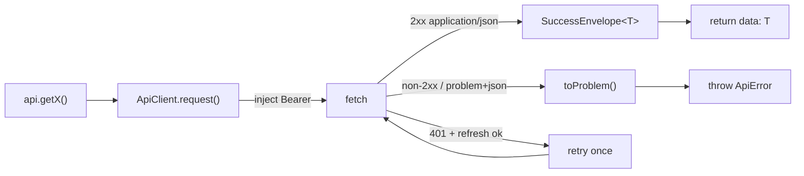

# P7 — Frontend Core

Phase-implementation document for **P7** of the SuperApp roadmap
(`PHASES.md`). Covers the `frontend/core` application: the React + TypeScript +
Vite + Tailwind + **ShadCN UI** scaffold, the typed API client (house
envelope + RFC 9457), OIDC Authorization-Code + PKCE against Rauthy,
role-based UI adaptation and route protection, the admin user-management and
conditional self-registration screens, the frontend module host, the SSE
client, and `VITE_*` configuration.

All work is test-driven (TR-00-001): each requirement's **Accept** criteria are
encoded as automated tests. Frontend tests run under **vitest** + **jsdom** +
**@testing-library/react**; `fetch`, the OIDC redirect, token `Storage`, and
the `EventSource` transport are all injected/mocked (there is no browser,
Rauthy, or live backend in this environment).

## Component architecture

## Auth / routing flow (FR-07-001, TR-07-003, TR-07-004)

## Response contract handling (TR-07-002)

Every 2xx is unwrapped from the house envelope to typed `data`; every non-2xx
(or any `application/problem+json` body) is parsed into an RFC 9457 `Problem`
and thrown as a typed `ApiError` that carries `status`, `type`, and
field-level `errors[{pointer, detail}]`.

## Requirement coverage

| Requirement | Summary | Design / where | Proving tests |
|---|---|---|---|
| **TR-07-001** | React+TS+Vite+Tailwind+ShadCN scaffold renders a baseline screen with a ShadCN component; mobile-first responsive | `index.html`, `src/main.tsx`, `src/App.tsx`, `src/index.css` (Tailwind + CSS vars), `components/ui/*` (ShadCN), `pages/HomePage.tsx` (responsive `sm:` grid); `npm run build` produces a bundle | `components/ui/button.test.tsx` (ShadCN Button variants + Radix Slot); `routes/AppRoutes.test.tsx::renders the dashboard for an authenticated user` |
| **TR-07-002** | Typed API client: unwraps house envelope, surfaces RFC 9457 problems, typed data | `api/client.ts` (`ApiClient`), `api/problem.ts` (`Problem`/`ApiError`/`toProblem`), `api/endpoints.ts` (`createApi`), `api/types.ts` | `api/client.test.ts` (envelope unwrap, problem→ApiError, field errors, problem+json body, facade URLs) |
| **TR-07-003** | OIDC Auth Code + PKCE with Rauthy: store tokens, inject `Authorization`, refresh on expiry (or re-login) | `auth/pkce.ts` (S256), `auth/oidc.ts` (`beginLogin`/`exchangeCode`/`refreshTokens`), `auth/tokenStore.ts` (persist + `isExpired`), `auth/AuthContext.tsx` (bootstrap refresh, header injection via client `getToken`/`onUnauthorized`) | `auth/pkce.test.ts` (RFC 7636 vector), `auth/oidc.test.ts` (authorize URL, code exchange, state mismatch, refresh), `auth/tokenStore.test.ts`, `api/client.test.ts::injects the Authorization header`, `::refreshes once and retries on 401` |
| **FR-07-001** | Login via Rauthy (SSO + user/pass are Rauthy methods) + logout clears session; no standalone registration UI unless enabled | `pages/LoginPage.tsx`, `auth/AuthContext.tsx` (`login`/`logout`/`completeLogin`), `auth/oidc.ts::buildLogoutUrl` | `pages/LoginPage.test.tsx::starts the OIDC redirect to Rauthy`; logout logic exercised via `AuthContext` (`logout` clears store + redirects to end-session) |
| **FR-07-002** | Role-based UI adaptation (Admin sees management/config/module-admin; User does not) | `components/layout/AppLayout.tsx` (nav gated on `isAdmin`), `pages/HomePage.tsx` (role badge) | `routes/AppRoutes.test.tsx::hides admin navigation from ordinary users`, `::shows admin navigation to admins` |
| **TR-07-004** | Role-based route protection (RR v6): unauth→login; user→admin route blocked; admin allowed | `routes/ProtectedRoute.tsx`, `routes/AppRoutes.tsx` | `routes/AppRoutes.test.tsx::redirects an unauthenticated visitor`, `::blocks a non-admin from an admin route`, `::allows an admin to reach the admin route` |
| **FR-07-003** | Admin user-management UI: allow-list by email + manage roles; non-admins cannot reach it | `pages/AdminUsersPage.tsx` (uses `api.listAllowlist/addToAllowlist/setUserRole`); reachability gated by admin `ProtectedRoute` | `pages/AdminUsersPage.test.tsx` (list, add, role change, RFC 9457 field error); `routes/AppRoutes.test.tsx::blocks a non-admin` |
| **FR-07-004** | Conditional self-registration UI only when `capabilities.self_registration_enabled` | `pages/LoginPage.tsx` (register action gated on capabilities from `AuthContext`) | `pages/LoginPage.test.tsx::hides the register action when disabled`, `::shows the register action only when enabled` |
| **TR-07-005** | Frontend module host: dynamic modules (routes, components, permissions, `initialize`/`cleanup`); routes hidden without permission | `modules/types.ts` (`FrontendModule`), `modules/registry.ts` (`ModuleRegistry`), integrated in `routes/AppRoutes.tsx` + `AppLayout` nav | `modules/registry.test.ts` (init/cleanup, duplicate id, `visibleRoutes`/`visibleNav` permission filtering) |
| **TR-07-006** | SSE client for `/api/v1/events/stream` with reconnect/resume via `Last-Event-ID` | `sse/sseClient.ts` (`SseClient`, injectable `EventSourceFactory`, exponential backoff, resume cursor) | `sse/sseClient.test.ts` (parse typed events, malformed frames, reconnect + resume, backoff, reset-on-open, stop after close) |
| **TR-07-007** | Configuration via `VITE_*`; missing required var fails with a clear error | `config/env.ts` (`loadConfig`/`ConfigError`/`getConfig`), `.env.example`, `src/vite-env.d.ts` | `config/env.test.ts` (resolves typed config, defaults, overrides, missing→error naming vars, blank→missing) |
| **TR-00-001** | Test-driven development | every requirement above ships with tests | full suite: **52 tests across 11 files, all green** |

## Deferred (runtime / e2e only)

These Accept criteria are inherently browser/network round-trips with no unit
surface; their **logic** is covered above and the end-to-end leg is deferred:

- **Real OIDC redirect round-trip** (browser → Rauthy → `/auth/callback`).
  Unit-covered: authorize-URL construction, PKCE S256, `state` CSRF check,
  token exchange, refresh, logout URL. Deferred: an actual browser navigation
  against a live Rauthy instance.
- **Live SSE stream + `Authorization` header transport.** The native
  `EventSource` cannot set headers; `SseClient` takes an `EventSourceFactory`
  so a header-capable polyfill (or a token-in-query fallback) is plugged at the
  edge. Unit-covered: reconnect, `Last-Event-ID` resume, backoff. Deferred: a
  real streamed connection.
- **Responsive rendering across breakpoints** is expressed with mobile-first
  Tailwind utilities (`container`, `sm:` grid) and verified structurally in
  tests; pixel-level cross-viewport verification is a manual/e2e check.

## Notes & carry-forward

- The backend endpoints in this frontend's contract
  (`/api/v1/auth/capabilities`, `/auth/me`, `/admin/allowlist`,
  `/admin/users/role`, `/events/stream`) are the agreed API surface; at the
  time of P7 the backend still exposes only the P3 scaffold routes, so those
  endpoints must be implemented backend-side to light up the live app. The
  frontend is coded and tested against the documented shapes.
- OIDC endpoint paths are derived from the issuer following Rauthy's defaults
  (`<issuer>/oidc/{authorize,token,logout}`). If a deployment publishes an
  OIDC discovery document, prefer wiring `oidc.ts` to
  `.well-known/openid-configuration`.
- The frontend is a **public** OIDC client (no secret), per TR-07-003.
