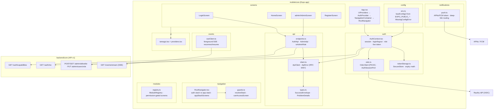
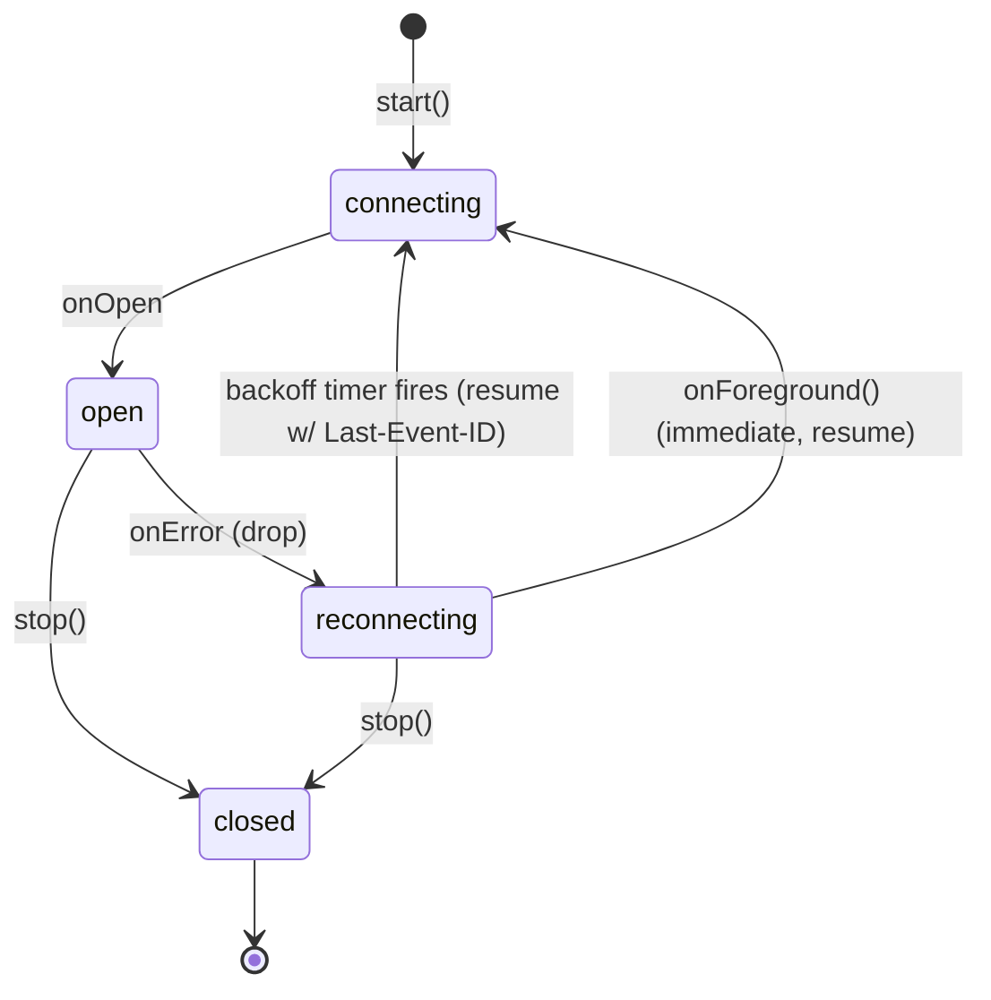

# P8 — Mobile core

React Native + Expo (SDK 57) + TypeScript mobile client for SuperApp, built
test-first. It consumes the backend core contract (success envelope + RFC 9457
errors), authenticates against Rauthy via OIDC Authorization Code + PKCE, stores
tokens in the device secure enclave, guards navigation by role, hosts pluggable
modules, streams live events over SSE in the foreground, and receives push
notifications in the background.

All work lives under `mobile/core`. Package manager: npm. UI: Tamagui
(`@tamagui/core` primitives). Navigation: React Navigation (native stack).

## Locked decisions & constraints

- **Auth**: `expo-auth-session` (Auth Code + PKCE, system browser, deep-link
  redirect `superapp://oauthredirect`). Tokens in `expo-secure-store`
  (Keychain/Keystore). Transparent refresh on expiry / 401.
- **API**: one typed `ApiClient`. Success → unwrap house envelope; error →
  throw typed `ApiError` carrying RFC 9457 Problem Details.
- **UI kit**: the kitchen-sink `tamagui` package pulls popper/menu native peers,
  so the baseline screens use `@tamagui/core` primitives wrapped in a small kit
  (`src/ui/tamagui.tsx`) — full theming/tokens, no extra native deps, renders
  under Jest.
- **Testing**: `jest-expo` + `@testing-library/react-native` (v14 — `render`,
  `renderHook`, `fireEvent` are **async** and must be awaited; needs the
  `test-renderer` peer). Network, `expo-auth-session`, `expo-secure-store`,
  `expo-notifications`, `expo-linking`, `expo-constants` are mocked
  (`jest.setup.ts`). No simulator/emulator/device/live backend in CI.

## Architecture



## Auth + role-based navigation flow (TR-08-003, FR-08-001/002, TR-08-004)

```mermaid
sequenceDiagram
    participant U as User
    participant App as AuthProvider
    participant SS as SecureStore
    participant B as System Browser
    participant R as Rauthy (OIDC)
    participant API as backend /auth/me
    participant Nav as RootNavigator

    App->>SS: load tokens (hydrate)
    alt no tokens
        App->>Nav: status=unauthenticated → Auth stack (Login)
        U->>App: tap "Sign in with SSO"
        App->>R: fetchDiscovery + AuthRequest (PKCE)
        App->>B: promptAsync (open system browser)
        B->>R: authenticate (SSO / username+password)
        R-->>B: redirect superapp://oauthredirect?code=…
        B-->>App: { type: success, code }
        App->>R: exchangeCode(code, code_verifier)
        R-->>App: access + refresh + id tokens
        App->>SS: save tokens (Keychain/Keystore)
    end
    App->>API: GET /auth/me (Bearer)
    API-->>App: { pid, email, name, role }
    App->>Nav: status=authenticated, isAdmin=role==admin
    Nav->>Nav: appStackScreens(isAdmin) → Home [+ Admin]
    Note over Nav: user → [Home]; admin → [Home, Admin]
```

## SSE lifecycle (TR-08-006)



The client owns policy (bearer auth, `Last-Event-ID` resume, exponential
backoff, foreground reconnect); the transport (injected) owns the long-lived
HTTP connection. Every SSE frame's `data` is parsed into the backend
`{ type, data, timestamp, user_id }` envelope.

## Requirement coverage

| Requirement | Summary | Design / where | Proving tests |
|---|---|---|---|
| **TR-08-001** | Scaffold builds & renders a baseline Tamagui screen (iOS+Android) | `App.tsx`, `ui/providers.tsx`, `ui/tamagui.tsx`, `screens/HomeScreen.tsx` | `screens/HomeScreen.test.tsx`: *renders the baseline screen with the signed-in identity*, *reflects the admin role* |
| **TR-08-002** | Typed API client: parse success envelope, surface RFC 9457 | `api/client.ts`, `api/types.ts` | `api/client.test.ts`: *unwraps data from the house success envelope*, *exposes pagination via requestEnvelope*, *throws a typed ApiError from an RFC 9457 problem+json body*, *synthesizes a problem when the error body is not problem+json* |
| **TR-08-003** | OIDC Auth Code + PKCE; tokens in secure storage; refresh on expiry | `auth/oidc.ts`, `auth/tokenStorage.ts`, `api/client.ts` (401 refresh) | `auth/oidc.test.ts`: *runs Auth Code + PKCE and exchanges the code with the verifier*, *refreshes tokens and preserves the old refresh token…*; `auth/tokenStorage.test.ts`: *saves tokens into expo-secure-store (Keychain/Keystore)*, *treats tokens within the skew window as expired*; `api/client.test.ts`: *refreshes once on 401 then retries with the new token* |
| **FR-08-001** | Login via Rauthy (SSO + username/password) + logout clearing session | `auth/AuthContext.tsx`, `screens/LoginScreen.tsx`, `auth/oidc.ts` | `auth/AuthContext.test.tsx`: *logs in via OIDC, persists tokens and exposes the user role*, *logs out, clearing session and stored tokens*; `screens/LoginScreen.test.tsx`: *starts the OIDC login on SSO press* |
| **FR-08-002** | Role-based navigation (Admin vs User) | `api/endpoints.ts` (`isAdminRole`), `auth/AuthContext.tsx` (`isAdmin`), `navigation/guards.ts` | `api/endpoints.test.ts`: *recognizes admin case-insensitively*, *rejects non-admin / empty*; `auth/AuthContext.test.tsx`: *hydrates an authenticated session…* (admin), *logs in…* (user); `navigation/guards.test.ts`: *grants admin areas only to the admin role* |
| **TR-08-004** | Nav guards: unauth→auth stack; user blocked from admin; admin allowed | `navigation/guards.ts`, `navigation/RootNavigator.tsx` (`appStackScreens`) | `navigation/guards.test.ts`: *routes by auth status*, *blocks a regular user from every admin-only screen*, *filters visible screens by role*; `navigation/RootNavigator.test.tsx`: *registers admin screens only for admins*, *shows the auth stack (login) when unauthenticated*, *shows the app home for an authenticated user/admin* |
| **FR-08-003** | Admin screens: allow-list by email + manage roles (web parity) | `screens/admin/AdminScreen.tsx`, `api/endpoints.ts` (`AdminApi`) | `screens/admin/AdminScreen.test.tsx`: *loads and lists existing allow-list entries*, *adds an allow-list entry by email*, *updates a user role*; `api/endpoints.test.ts`: *lists the allowlist*, *adds an allowlist entry by email*, *updates a user role* |
| **FR-08-004** | Self-registration shown only when `capabilities.self_registration_enabled` | `screens/LoginScreen.tsx`, `api/endpoints.ts` (`capabilities`) | `screens/LoginScreen.test.tsx`: *shows the self-registration option only when enabled*, *hides the self-registration option when disabled*; `api/endpoints.test.ts`: *probes capabilities without auth* |
| **TR-08-005** | Module host: dynamic load, `initialize`/`cleanup`, permission-gated screens | `modules/registry.ts`, `modules/types.ts` | `modules/registry.test.ts`: *runs initialize on register and cleanup on unregister*, *rejects duplicate registration*, *hides screens whose required permission is not granted*, *reveals all screens when every permission is granted*, *resolves module-contributed components* |
| **TR-08-006** | Foreground SSE with reconnect/resume on drop and on foreground | `events/sseClient.ts` | `events/sseClient.test.ts`: *connects with bearer auth and marks the stream open*, *parses event frames and tracks the last event id*, *reconnects on drop and resumes via Last-Event-ID*, *reconnects immediately on app-foreground when the stream is down*, *stop() cancels reconnection…* |
| **TR-08-007** | Config via `EXPO_PUBLIC_*`; missing required var fails clearly | `config/env.ts`, `.env.example` | `config/env.test.ts`: *parses a complete environment*, *respects overrides…*, *throws MissingConfigError listing every missing required var*, *treats blank/whitespace values as missing* |
| **TR-08-008** | Background push (APNs/FCM); tap deep-links to relevant screen | `notifications/push.ts`, `app.json` (`expo-notifications`) | `notifications/push.test.ts`: *routes to an explicit screen with params*, *maps a known event type to its screen*, *registers and returns a push token when permission is granted*, *returns null (no token) when permission is denied…*, *navigates on a notification tap and returns an unsubscribe* |
| **TR-00-001** | Test-driven development | every requirement above ships with tests | full suite green (70 tests, 14 suites) |

## Verification

```
cd mobile/core
npx tsc --noEmit     # → exit 0 (no type errors)
npm test             # → 14 suites, 70 tests, all passing
```

## Notes & carry-forward (honest deferrals)

- **No native build / device run here.** A full `expo run:ios` / `expo
  run:android` needs Xcode/Android SDK + a simulator/emulator, none of which
  exist in this environment. TR-08-001's *"builds and renders on iOS+Android"*
  is proven at the component-render level (Tamagui trees render under Jest);
  the on-device build/run is **deferred** to a machine with the native
  toolchains. `expo export` / typecheck / Jest are the CI-level gates used
  instead.
- **Real deep-link round-trip is not exercised.** The OIDC browser hop
  (`promptAsync` → `superapp://oauthredirect`) is driven through the injectable
  `AuthSessionPort` with a scripted result; the *logic* (PKCE code→token
  exchange, refresh, secure-store persistence, role hydration) is fully tested.
  The actual system-browser + OS deep-link handshake is **deferred** to device.
- **Push delivery has no backend yet (cross-phase dependency).** TR-08-008
  implements the entire **client** half — permission, APNs/FCM token
  acquisition, tap→route deep-linking. The backend has **no push-send
  capability** (P6 delivers only foreground SSE). Required backend follow-up,
  to be scheduled as its own work item:
  1. a device-registration endpoint to store the push token per user;
  2. a fan-out worker that mirrors relevant domain events to APNs/FCM so events
     are delivered while the app is backgrounded (SSE cannot run backgrounded).
  Real end-to-end push delivery is **deferred** until that backend exists and a
  physical device with APNs/FCM credentials is available (push does not work on
  simulators).
- **SSE transport is injected.** RN has no built-in `EventSource`; the client
  owns reconnect/resume policy and a production transport (fetch/XHR streaming)
  is wired at the app edge. Live receipt over a real long-lived connection is
  **deferred** to device; policy is fully unit-tested with a fake transport.
```
