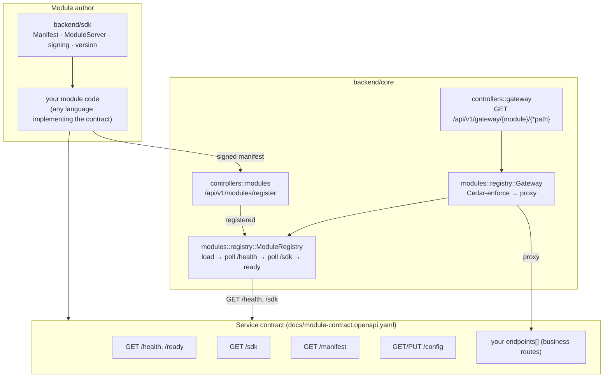
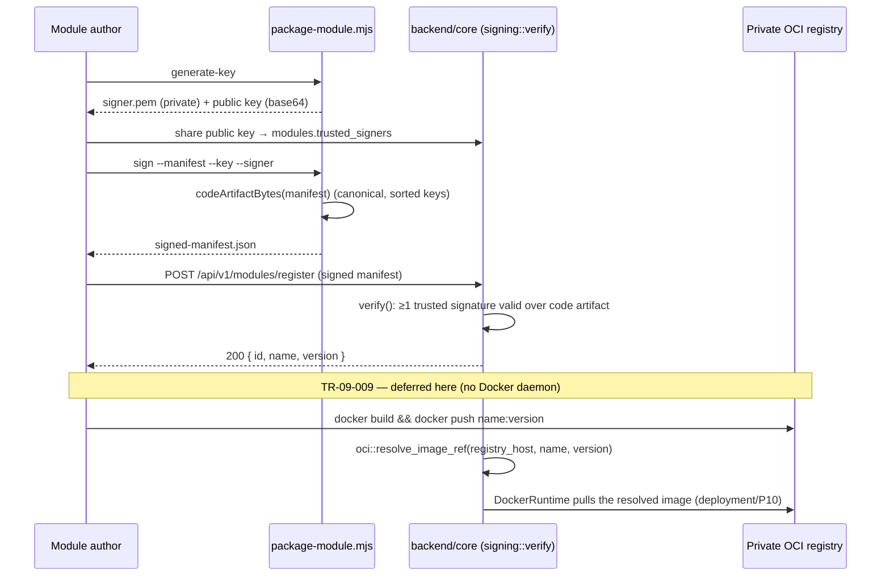

# P9 — Module SDK & Reference Module

Phase-implementation document for **P9** of the SuperApp roadmap
(`PHASES.md`). Covers the backend module SDK + service contract, the
frontend and mobile module SDKs, the canonical cross-platform manifest
schema, SDK version compatibility, module scaffolding + signed packaging, the
cross-platform reference module, module-author documentation, and private
OCI distribution resolution.

All work is test-driven (TR-00-001): each requirement's **Accept** criteria
are encoded as automated tests. Backend tests run against PGlite + live
Redis, serially (`cargo test -- --test-threads=1`); frontend/mobile use
vitest/jest; the scaffolding/packaging CLIs use Node's built-in test runner.

## Locked decisions honoured

- **Out-of-process containers behind a core gateway** (P5, unchanged) — the
  SDK's `ModuleServer` implements the HTTP side of that contract; it does not
  reintroduce an in-process/cdylib model.
- **Signed OCI distribution** — signatures cover the immutable code artifact
  only (TR-05-002); OCI images push to a **self-hosted private registry**,
  never a public one.
- **One canonical manifest schema** — `schemas/module-manifest.schema.json`
  is the single source of truth; the core's `Manifest` did **not** change
  shape to accommodate P9 (verified by cross-checking tests on every side —
  see the requirement table).
- **Dependency injection** for anything daemon-backed — the container
  runtime seam (P5) is reused to run the *real* reference-module router
  in-process (no Docker here); the OCI registry interaction is a pure,
  unit-tested resolver function, with real build/push explicitly deferred.

## Requirement coverage

| Requirement | Summary | Design / where | Proving tests |
|---|---|---|---|
| **TR-09-001** | Backend module SDK + service contract (documented) | `backend/sdk` (`ModuleServer`, `Manifest`, `config_schema`, `signing`, `version`); contract documented at [`docs/module-contract.openapi.yaml`](../module-contract.openapi.yaml); live gateway route `controllers::gateway` (`GET /api/v1/gateway/{module}/{*path}`) | `backend/sdk`: `server::tests::*` (5); `backend/core`: `requests::gateway::*` (2), `requests::reference_module::*` (2) |
| **TR-09-002** | Frontend module SDK (TS) | `frontend/sdk/src/{types,manifest,version}.ts` | `frontend/sdk`: `manifest.test.ts` (3), `version.test.ts` (5); `frontend/modules/reference`: `module.test.ts` (5) |
| **TR-09-003** | Mobile module SDK (TS) | `mobile/sdk/src/{types,manifest,version}.ts` | `mobile/sdk`: `manifest.test.ts` (3), `version.test.ts` (5); `mobile/modules/reference`: `module.test.ts` (5) |
| **TR-09-004** | Canonical manifest schema, no divergence | `schemas/module-manifest.schema.json`; mirrored in `backend/core::modules::manifest::Manifest` (unchanged shape), `backend/sdk::manifest::Manifest`, `frontend/sdk`'s `Manifest`, `mobile/sdk`'s `Manifest` | `backend/core`: `modules::manifest::tests::matches_canonical_manifest_schema`; `backend/sdk`: `manifest::tests::matches_the_canonical_schema`; `frontend/sdk` + `mobile/sdk`: *"matches the canonical schema shared with..."* |
| **TR-09-005** | SDK versioning & compatibility | `backend/core::modules::compat` (`check_compatible`, enforced in `registry::ModuleRegistry::load` via `GET /sdk`); `backend/sdk::version`; `frontend/core`/`mobile/core` `ModuleRegistry.register()` (`isSdkVersionCompatible`) | `backend/core`: `modules::compat::tests::*` (3), `modules::registry::tests::{compatible_sdk_version_loads, incompatible_sdk_version_is_rejected_at_load, module_with_no_sdk_endpoint_still_loads}`; `backend/sdk`: `version::tests::*` (3); `frontend/sdk`/`mobile/sdk`: `version.test.ts` (5 each); `frontend/core`/`mobile/core`: *"TR-09-005 SDK version compatibility"* (4 each) |
| **TR-09-006** | Scaffolding + signed packaging (SHOULD) | `scripts/module-sdk/scaffold-module.mjs`, `scripts/module-sdk/package-module.mjs` + `canonical.mjs` | `scripts/module-sdk/__tests__/*.mjs` (9, incl. a real `cargo test` of a scaffolded crate — see Notes); cross-language fixture: `backend/sdk::manifest::tests::matches_js_packaging_fixture` ⇄ `canonical.test.mjs`; end-to-end: `backend/core`'s `tests/module_packaging.rs::packaging_script_output_is_accepted_by_the_real_loader` (spawns the real CLI, verifies with the real loader) |
| **TR-09-007** | Reference module (cross-platform, end-to-end) | `backend/modules/reference`, `frontend/modules/reference`, `mobile/modules/reference` | Backend: `requests::reference_module::{reference_module_registers_via_the_real_manifest, reference_module_loads_and_its_route_is_cedar_gated_end_to_end}`; Web: `frontend/core`'s `reference.integration.test.ts`; Mobile: `mobile/core`'s `reference.integration.test.ts` |
| **TR-09-008** | Module-author documentation (SHOULD) | [`docs/module-authoring.md`](../module-authoring.md), [`docs/module-contract.openapi.yaml`](../module-contract.openapi.yaml), this document | The reference module was built by following this document (self-proving); every code sample in it is the reference module's actual code |
| **TR-09-009** | Private OCI distribution | `backend/core::modules::oci::resolve_image_ref`; `ModulesSettings.registry_host` (`backend/core/src/auth/config.rs`), wired into `AuthState.registry_host` | `backend/core`: `modules::oci::tests::*` (4) |
| **TR-00-001** | TDD | every requirement above ships with tests | full suite green (see Verification) |

## Architecture: SDK + service contract



## Reference module: cross-platform wiring

```mermaid
flowchart LR
    subgraph BE["backend/modules/reference"]
        BM["manifest(): reference@1.0.0<br/>endpoint GET /items → reference:read<br/>config_schema requires greeting"]
        BR["router(): ModuleServer + /items"]
    end
    subgraph FE["frontend/modules/reference"]
        FM["referenceModule: FrontendModule<br/>route /reference → reference:read<br/>nav entry"]
    end
    subgraph MO["mobile/modules/reference"]
        MM["referenceModule: ModuleDefinition<br/>screen Reference → reference:read"]
    end

    BM --> BR
    BR -->|"in-process runtime<br/>(no Docker here)"| Gateway["backend/core Gateway<br/>Cedar-gates reference:read"]
    Gateway -->|bob (user): 403 Forbidden| Deny(("blocked before<br/>reaching the module"))
    Gateway -->|boss (admin): 200| BR

    FM -->|"ModuleRegistry.register()"| WebHost["frontend/core ModuleRegistry<br/>visibleRoutes/visibleNav"]
    MM -->|"ModuleRegistry.register()"| MobileHost["mobile/core ModuleRegistry<br/>screensFor/visibleScreens"]
```

## Signing + OCI distribution flow



## Notes & carry-forward (honest deferrals)

- **No Docker daemon, no browser/simulator here.** The `ContainerRuntime` seam
  (P5) again does the work: the reference-module end-to-end test
  (`reference_module_loads_and_its_route_is_cedar_gated_end_to_end`) runs the
  **real** `reference_module::router()` in-process via a test-only
  `RealReferenceModuleRuntime`, not a synthetic fake — real manifest, real
  config-schema, real HTTP contract, only the container boundary is swapped.
- **Live gateway route mounted, but not requestable end-to-end here.** P5's
  phase doc flagged "the live gateway proxy route through the booted app" as
  a P9 follow-up; `controllers::gateway` now mounts it
  (`GET /api/v1/gateway/{module}/{*path}`). Because `AuthState`'s
  `ModuleRegistry` is wired to the production `DockerRuntime`, no module is
  ever actually `load`ed into the booted app in this environment — the route
  is proven to authenticate and 404-cleanly for an unloaded module
  (`requests::gateway.rs`), while the full register→load→proxy→Cedar path is
  proven at the `ModuleRegistry`/`Gateway` level against real code (above).
- **OCI build/push is deferred**, exactly as instructed: `oci::resolve_image_ref`
  is unit-tested pure logic (name+version → image ref, always scoped under
  `modules/` on the configured private host, never a public-registry
  shorthand); actually building and pushing an image is a CI/deployment
  concern for P10 (`TR-10-005`/`TR-10-006`).
- **No npm workspaces.** `frontend/sdk` → `frontend/modules/reference` →
  `frontend/core` (and the mobile equivalents) are connected by plain
  relative TypeScript imports, not package-manager linking — there's no
  monorepo tool (npm/pnpm workspaces) configured in this repo yet. This is
  called out explicitly rather than silently worked around; adopting one is
  a natural P10+ follow-up once modules are actually published as installable
  packages.
- **gRPC core↔module transport** remains the noted future target (P5); this
  phase's contract is HTTP, matching `ContainerRuntime`/`Gateway::proxy_get`.
- **`backend/sdk` and `backend/modules/reference` are standalone Cargo
  crates** (their own `[workspace]`, like `backend/core` itself), not members
  of `backend/core`'s workspace — `backend/core` reaches `reference-module`
  only via a `[dev-dependencies]` path dependency, so its own workspace
  boundary and MSRV pins (rustc 1.85) are untouched.
